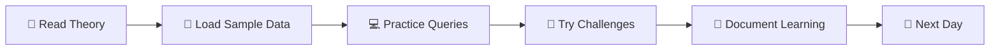
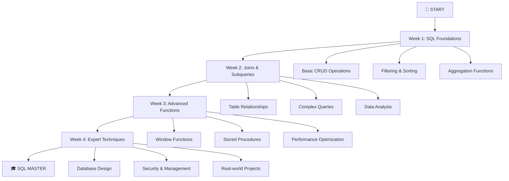

# 🗄️ SQL 30 Days Roadmap

<div align="center">


### 🚀 **Master SQL in 30 Days** 🚀
*From Zero to Database Hero with Hands-on Practice*

[](https://github.com/username/sql-30-days)
[](https://github.com/username/sql-30-days/fork)
[](CONTRIBUTING.md)

</div>

---

## 🎯 **What You'll Achieve**

<table>
<tr>
<td align="center" width="33%">

<h3>🏗️ Database Design</h3>
<p>Master table creation, relationships, and normalization</p>
</td>
<td align="center" width="33%">

<h3>🔍 Complex Queries</h3>
<p>Write advanced JOIN operations and subqueries like a pro</p>
</td>
<td align="center" width="33%">

<h3>⚡ Performance Optimization</h3>
<p>Learn indexing, query optimization, and best practices</p>
</td>
</tr>
</table>

---

## 📊 **Progress Dashboard**

<details open>
<summary><h3>🏆 Week 1: Foundation Building</h3></summary>

| Day | Topic | Status | Difficulty | Estimated Time |
|-----|--------|--------|------------|----------------|
| 01 | SQL Basics: `CREATE`, `INSERT`, `SELECT` | ✅ | 🟢 Easy | 1-2 hours |
| 02 | Filtering & Sorting: `WHERE`, `ORDER BY` | ✅ | 🟢 Easy | 1-2 hours |
| 03 | Aggregations: `COUNT`, `SUM`, `GROUP BY` | ✅ | 🟡 Medium | 2-3 hours |
| 04 | Data Types & Constraints | ⏳ | 🟡 Medium | 2 hours |
| 05 | String Functions & Pattern Matching | ⏳ | 🟡 Medium | 2 hours |
| 06 | Date & Time Functions | ⏳ | 🟡 Medium | 2-3 hours |
| 07 | CASE Statements & Conditional Logic | ⏳ | 🟡 Medium | 2 hours |

</details>

<details>
<summary><h3>🚀 Week 2: Intermediate Skills</h3></summary>

| Day | Topic | Status | Difficulty | Estimated Time |
|-----|--------|--------|------------|----------------|
| 08 | INNER JOIN Fundamentals | ⏳ | 🟡 Medium | 2-3 hours |
| 09 | LEFT, RIGHT, FULL OUTER JOINs | ⏳ | 🟡 Medium | 2-3 hours |
| 10 | Self Joins & Multiple Table Joins | ⏳ | 🟠 Hard | 3-4 hours |
| 11 | Subqueries: Scalar & Multi-row | ⏳ | 🟠 Hard | 3 hours |
| 12 | Correlated Subqueries | ⏳ | 🔴 Expert | 3-4 hours |
| 13 | Common Table Expressions (CTEs) | ⏳ | 🟠 Hard | 2-3 hours |
| 14 | UNION, INTERSECT, EXCEPT | ⏳ | 🟡 Medium | 2 hours |

</details>

<details>
<summary><h3>🎓 Week 3: Advanced Techniques</h3></summary>

| Day | Topic | Status | Difficulty | Estimated Time |
|-----|--------|--------|------------|----------------|
| 15 | Window Functions: ROW_NUMBER, RANK | ⏳ | 🔴 Expert | 4 hours |
| 16 | Advanced Window Functions | ⏳ | 🔴 Expert | 4 hours |
| 17 | Pivot & Unpivot Operations | ⏳ | 🟠 Hard | 3 hours |
| 18 | Stored Procedures & Functions | ⏳ | 🔴 Expert | 4 hours |
| 19 | Triggers & Events | ⏳ | 🔴 Expert | 3-4 hours |
| 20 | Indexing & Query Optimization | ⏳ | 🔴 Expert | 4 hours |
| 21 | Database Views & Materialized Views | ⏳ | 🟠 Hard | 3 hours |

</details>

<details>
<summary><h3>💎 Week 4: Expert Level</h3></summary>

| Day | Topic | Status | Difficulty | Estimated Time |
|-----|--------|--------|------------|----------------|
| 22 | Advanced Data Modeling | ⏳ | 🔴 Expert | 4-5 hours |
| 23 | JSON & XML Data Handling | ⏳ | 🟠 Hard | 3-4 hours |
| 24 | Database Security & User Management | ⏳ | 🟠 Hard | 3 hours |
| 25 | Backup & Recovery Strategies | ⏳ | 🔴 Expert | 4 hours |
| 26 | Performance Tuning & Monitoring | ⏳ | 🔴 Expert | 4-5 hours |
| 27 | Advanced Analytics & Reporting | ⏳ | 🔴 Expert | 4 hours |
| 28 | Data Migration & ETL Processes | ⏳ | 🔴 Expert | 4-5 hours |
| 29 | Real-world Problem Solving | ⏳ | 🔴 Expert | 5 hours |
| 30 | 🎉 **CAPSTONE PROJECT** 🎉 | ⏳ | 🔴 Expert | 6-8 hours |

</details>

---

## 🛠️ **Getting Started**

### Prerequisites
```bash
# Required Software
✅ PostgreSQL 13+ / MySQL 8+ / SQL Server 2019+
✅ Your favorite code editor (VS Code recommended)
✅ Basic understanding of data concepts
```

### Quick Setup
```bash
# Clone the repository
git clone https://github.com/username/sql-30-days-roadmap.git
cd sql-30-days-roadmap

# Choose your database and run setup
./setup.sh postgresql  # or mysql, sqlserver
```

### Daily Routine
<div align="center">



</div>

---

## 🎨 **Project Structure**

```
sql-30-days-roadmap/
├── 📁 day_001_sql_basics/
│   ├── 📄 README.md          # Theory & explanations
│   ├── 🗃️ sample_data.sql    # Sample dataset
│   ├── 💻 exercises.sql      # Practice queries
│   └── ✅ solutions.sql      # Solution explanations
├── 📁 day_002_filtering/
│   └── ... (same structure)
├── 📁 datasets/
│   ├── 🏪 ecommerce_db/     # E-commerce sample data
│   ├── 🏥 healthcare_db/    # Healthcare analytics
│   └── 📊 financial_db/     # Financial transactions
└── 📁 resources/
    ├── 📚 cheatsheets/
    ├── 🔗 useful_links.md
    └── 🆘 troubleshooting.md
```

---

## 🏆 **Achievements & Milestones**

<div align="center">

| 🎖️ Badge | Requirement | Reward |
|-----------|-------------|---------|
| 🌱 **SQL Seedling** | Complete Days 1-7 | Basics Mastery Certificate |
| 🌿 **Query Craftsman** | Complete Days 8-14 | JOIN Expert Badge |
| 🌳 **Database Architect** | Complete Days 15-21 | Advanced SQL Certificate |
| 🦅 **SQL Eagle** | Complete Days 22-29 | Expert Level Recognition |
| 👑 **Database Royalty** | Complete All 30 Days | Master Certificate + LinkedIn Badge |

</div>

---

## 💡 **Pro Tips for Success**

<table>
<tr>
<td width="50%">

### 🎯 **Study Strategy**
- ⏰ Dedicate 1-3 hours daily
- 📝 Take notes in your own words  
- 🔄 Review previous concepts regularly
- 🤝 Join our Discord community for help

</td>
<td width="50%">

### 🚀 **Practice Makes Perfect**
- 💻 Type out every query manually
- 🧪 Experiment with variations
- 🐛 Debug errors to understand concepts
- 📊 Work with real-world datasets

</td>
</tr>
</table>

---

## 🌟 **Community & Support**

<div align="center">

[](https://discord.gg/sql30days)
[](https://reddit.com/r/sql30days)
[](https://stackoverflow.com/questions/tagged/sql30days)

**💬 Need Help?** | **🐛 Found a Bug?** | **💡 Suggestions?**
Join our Discord | Open an Issue | Start a Discussion

</div>

---

## 📈 **Learning Path Visualization**

<div align="center">



</div>

---

## 🙏 **Acknowledgments**

<div align="center">

**Built with ❤️ by the SQL Community**

[](https://github.com/username/sql-30-days-roadmap/graphs/contributors)

*Special thanks to all contributors who make this learning journey possible!*

---

### 📜 **License**
This project is licensed under the MIT License - see the [LICENSE](LICENSE) file for details.

### ⭐ **Show Your Support**
If this roadmap helps you on your SQL journey, please give it a star! ⭐

**Happy Coding! 🎉 Let's master SQL together!** 💪

</div>